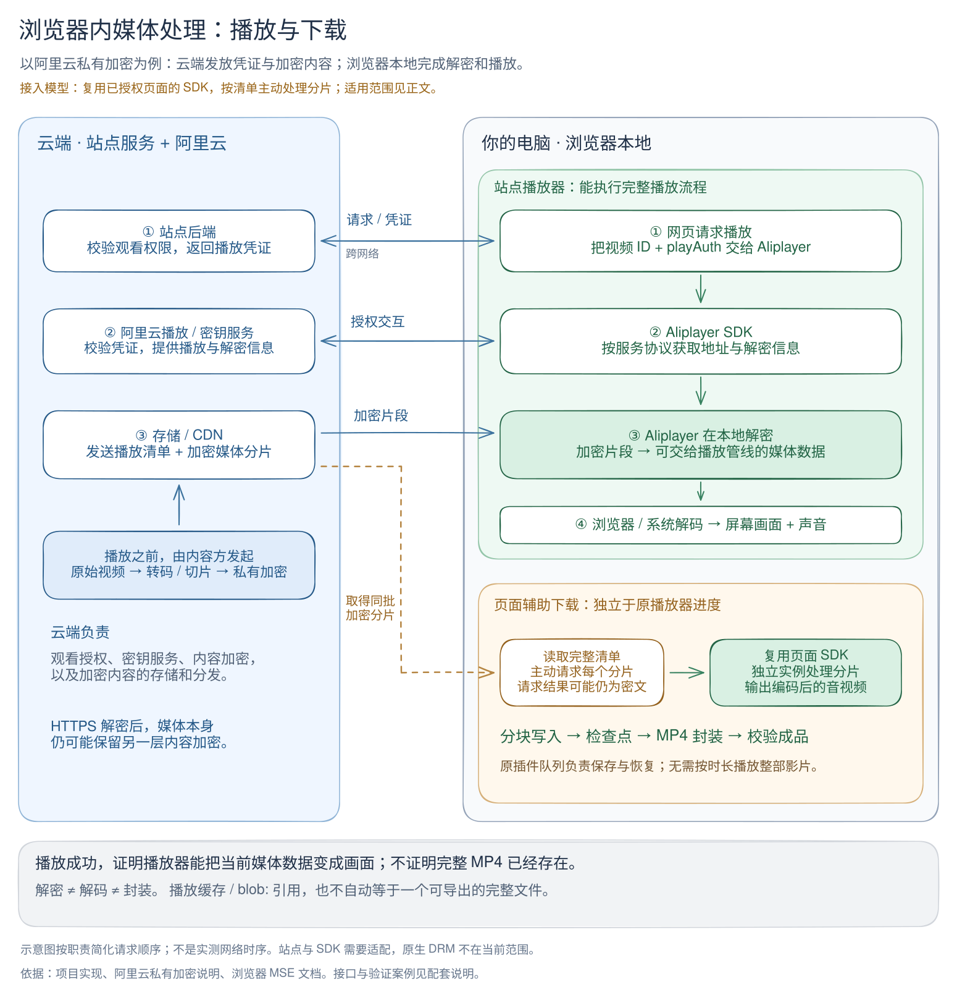

# 浏览器内媒体处理与下载

有些视频不能只靠媒体地址下载。站点播放器还持有短时授权上下文，并使用专用 SDK
处理媒体。插件为这类来源提供 `browser-session` 执行方式：在已授权的网页中调用
已加载的处理模块，把输出交给现有下载队列，持续写盘并封装成 MP4。

这项能力需要明确的站点和播放器适配。目前的接入示例是 Koala 使用的 Aliplayer
2.37.0；不能仅凭另一个网站也使用 Aliplayer，就推断它已经受支持。

## 使用方法

1. 加载或重载 `.output/chrome-mv3` 中的 **Open Media Downloader**，刷新来源页。
2. 打开已登录且有播放权限的视频页，从原插件点击“下载”，无需先点击播放。
3. 在下载队列中选择输出目录并启动。页面辅助任务固定输出 MP4。
4. 集合页使用“扫描并批量下载”，勾选条目后加入同一队列。

插件优先复用已经打开的对应视频页；没有可用页面时准备临时后台标签页。只关闭
自己创建的标签页，保留用户原有页面。正式下载使用独立处理实例，不暂停原播放器，
也不要求播放进度走完整部影片。

任务启动时会准备尚未初始化的播放器：等待站点取得有效来源，再加载必要的初始
缓冲以建立处理模块。这个步骤不调用播放、不修改静音/自动播放设置，也不推进
播放进度；仅打开页面或弹出插件菜单不会触发它。

清晰度沿用当前页面；新建来源页使用播放器默认清晰度，当前没有额外的清晰度
选择器。需要保留下载管理页和有效的浏览器会话。队列记录能保存，不表示关闭
浏览器后下载仍会继续。

| 队列情况 | 含义与处理 |
| --- | --- |
| 等待来源页面 | 页面失联、会话失效或暂不可用；打开/刷新对应视频，点击“继续”或“重试”，再启动队列 |
| 等待重试 | 暂时网络错误；按队列设置退避重试 |
| 来源或计划不兼容 | 内容、清晰度或初始化信息改变；保留已提交文件，需重新开始 |
| 完成 | 全部分片已处理，成品关闭并通过结构/时长校验，完成状态已保存 |

如果准备阶段超时，诊断报告的 `failure.params` 会记录 `stage: prepare`、`reason`、
已观察/已连接的 SDK 实例数及 `mediaReadyState`。例如 `sdk-uninitialized` 表示 SDK
实例未建立，`manifest-pending` 表示清单未就绪，`processor-pending` 表示分片处理
模块未建立，`metadata-pending` 表示首帧元数据未就绪。这些状态不包含播放凭证。
后续“重试”会清除任务当前错误，但事件历史保留独立的失败快照；此前版本未保存
的历史细节无法补回。可在任务详情中导出诊断报告，检查当前状态与历史失败原因。

例如，在 [Koala 首页](https://app.koala-oss.club/) 可以发现当前页面里的视频链接，
单个 `/videos/<UUID>` 页面则对应一个任务。它是站点适配的例子，不是对任意
Aliplayer 网页的自动识别或全站爬取。实测范围见[验证与案例](browser-media-validation.md)。

## 为什么能播放不等于能直接保存

浏览器播放涉及三个不同动作：

| 动作 | 输入与输出 |
| --- | --- |
| 解密 | 加密媒体字节 → 未加密但仍经压缩编码的媒体 |
| 解码 | H.264、AAC 等编码数据 → 画面与声音 |
| 封装 | 编码数据与时间信息 → 可独立播放的 MP4；兼容时无需重新编码 |

以阿里云私有加密为例，云端负责权限、凭证、内容加密和分发，播放器 SDK 在本地
处理加密内容。仅保存 CDN 响应，仍可能得到密文。这个职责模型来自
[阿里云私有加密说明](https://help.aliyun.com/zh/vod/user-guide/alibaba-cloud-proprietary-cryptography)。

扩展 content script 与页面脚本默认处于隔离环境，不能自动取得播放器变量和内部
状态，需要专门的页面桥接。[Chrome content scripts 文档](https://developer.chrome.com/docs/extensions/develop/concepts/content-scripts)

`blob:` 也不保证指向完整 MP4。MSE 播放通常持续追加和回收缓冲，跳播可能只请求
部分分片。可播放的缓冲区不等于包含整部影片的可导出文件。
[Media Source API](https://developer.mozilla.org/en-US/docs/Web/API/Media_Source_Extensions_API)

## 云端与本地分工

[可编辑 Excalidraw](diagrams/browser-media-flow.excalidraw) · [SVG](diagrams/browser-media-flow.svg)

图以 Aliplayer 处理链路为例，按职责简化请求顺序；不是某个真实账户的网络时序。
页面辅助下载按完整清单主动请求分片，独立实例处理后交给扩展封装。它不采集屏幕
像素，不等待原播放器逐秒播放，也不把媒体送到新的云端解密服务。

| 位置 | 工作与持有的数据 |
| --- | --- |
| 网站后端、播放/密钥服务 | 校验观看权限，提供播放凭证、地址与处理所需信息 |
| CDN | 分发清单和媒体分片，分片可能仍然加密 |
| 浏览器网页 MAIN world | 复用已加载 SDK 和当前授权上下文，独立处理每个分片 |
| 扩展后台与 content script | 验证内部消息来源，转发受限命令、计划和有界媒体块 |
| 下载管理页中的 runtime | 调度、检查点、时间线检查、MP4 封装、成品提交 |
| 本地输出目录 | 音视频 partial 和最终 MP4 |

授权上下文、密钥和 SDK 对象留在页面内存，不写入任务仓库或诊断报告。浏览器
来源会话是临时能力；通用 runtime 可移植，不代表 Node、Electron 或云端自动
继承浏览器的登录状态。

## 代码分层与接入点

| 层 | 入口与职责 |
| --- | --- |
| 检测、集合发现 | `src/core/detection/adapters/`、`src/core/discovery/adapters/`：站点匹配、媒体身份、标题、列表 |
| 页面处理服务 | `src/core/site-adapters/aliplayer/source-service.ts`：完整清单、SDK 独立实例、分片处理与释放 |
| 宿主接口 | `src/runtime/media-source.ts`：`MediaSourceProvider` / `MediaSourceSession` |
| 浏览器宿主 | `src/browser/media-source-provider.ts`：标签页准备、连接、读取、关闭自有页面 |
| 消息协议 | `src/shared/browser-source.ts`、`src/browser/page-source-bridge.ts`：命令、数据上限、校验与超时 |
| 任务执行 | `src/runtime/task-executors/browser-source.ts`：顺序处理、写盘、恢复、最终封装 |

执行器按 `(kind, mode)` 选择。现有 HLS/DASH/Progressive 默认为 `http`；页面辅助
HLS 使用 `browser-session` 和宿主传入的可选 `mediaSourceProvider`。协议解析与
站点识别保持分层，公共 runtime 不导入 DOM 或扩展 API。

消息经过 `manager → background → isolated content script → MAIN world`。后台
核验 manager 的真实扩展 sender，并使用其标签页 ID 作为会话所有者。会话还绑定
媒体身份和随机 ID，导航、媒体移除或空闲超时会使其失效。MAIN world 与目标网页
共享环境；消息校验不把网页输出变成可信数据，扩展仍需校验结构、大小与时间线。

新增站点时，先实现精确域名/路径匹配、稳定媒体身份、检测与集合发现。随后判断
能否复用现有页面服务；若播放器处理接口不同，再添加 provider、协议校验与宿主
路由。当前 provider 枚举和页面路由有明确白名单，仅注册发现 adapter 并不足够。
接入必须同时覆盖越界站点不匹配、页面切换、签名刷新、恢复与实际产物验证。

## 写盘、恢复与资源上限

来源计划包含完整分片顺序、时长、视频身份和清晰度。指纹计入 codec 和资源路径，
排除签名查询参数。刷新签名不会单独改变计划身份；恢复仍需检查初始化段指纹，
防止混用不同内容或轨道。播放授权过期时允许一次新页面会话刷新。

页面服务一次保留一个处理后分片。输入单片上限 32 MiB，处理输出合计上限 64 MiB；
扩展每次最多读取 128 KiB，写入音视频 partial，再确认释放该分片。媒体负载不随
整部影片累计到内存，但计划和分片边界元数据随分片数量增长，清单最多 100,000 项。
这些限制不是浏览器进程总内存的测量值。

检查点版本 3 保存目录身份、计划指纹、轨道初始化指纹、已提交字节边界和时间线
端点。每四个分片或最后一个分片关闭两份文件，提交成功后再持久化检查点。恢复时
核对文件名和边界，截断未提交尾部；最多需要重新请求该批尚未提交的分片。
旧版本 1/2 检查点继续由原执行器处理。

全部分片已提交后，可以脱离来源页面完成本地封装。最终 MP4 时长必须与完整计划
一致，再由 runtime 保存完成状态并清理 partial。MP4 封装期间需要同时容纳两份
轨道 partial 和成品。完整提交顺序见[runtime 架构](runtime-architecture.md)。

## 当前边界

当前页面处理实现接受静态、连续的单播放列表音视频，尚不支持直播、byte-range、
外置音轨、动态 codec、需要额外 key 获取的加密路径或原生 DRM。阿里云私有加密
与 Widevine/FairPlay 等原生 DRM 不应混同；一个已适配案例不代表所有保护方式可用。

普通网络失败复用队列恢复。页面服务另有单次请求 30 秒、SDK 处理 20 秒的上限，
宿主等待来源就绪最多 40 秒；这些没有全部映射为管理页的网络设置。SDK 内部接口
或站点结构改变需要重新验证。浏览器休眠、管理页关闭和会话失效仍受宿主生命周期
约束；尚未做长时内存压力或浏览器真实崩溃验收。
